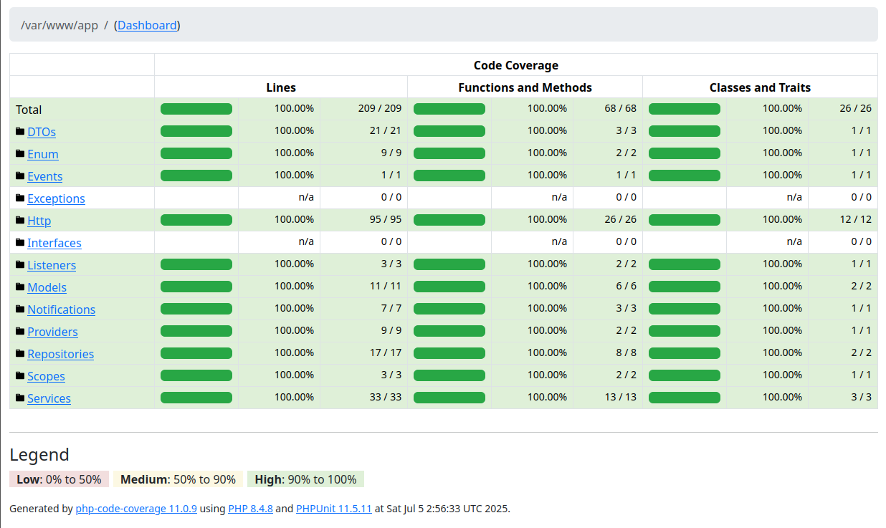

# 🧳CorporateGo - Microsserviço de Pedidos de Viagem Corporativa
<center></center>

Este projeto é um microsserviço RESTful desenvolvido em Laravel com foco na gestão de pedidos de viagem corporativa.  
A aplicação permite que usuários autenticados criem, consultem, filtrem, aprovem e cancelem pedidos de viagem, com envio de notificações por e-mail em determinadas ações.

---

### ⚙️ Tecnologias Utilizadas

- PHP 8.4
- Laravel (versão mais recente)
- MySQL (em ambiente de produção)
- SQLite (para testes)
- Docker + Docker Compose
- JWT (autenticação)
- PHPUnit (testes automatizados)

---

### 🚀 Funcionalidades

- 📄 CRU (CRUD sem o Delete, rs) de pedidos de viagem
- ✅ Aprovação ou cancelamento de pedidos (restrito a usuários autorizados)
- 🔍 Filtros por status, destino e período (start/end date)
- ✉️ Notificações por e-mail em ações de status
- 🔐 Autenticação via JWT
- 👤 Cada usuário acessa apenas suas próprias ordens

---

## 🧪 Rodando o Projeto Localmente

### 📥 Pré-requisitos

- Docker e Docker Compose instalados

### 🐳 Subindo os containers

```bash
 docker compose up -d
```

### 🛠️ Acessando o container da aplicação
```bash
 docker compose exec app bash
```
### 📦 Instalando dependências
```bash
 composer install
```
### 🔑 Gerando chave da aplicação
```bash
 php artisan key:generate
```

### 🔐 Gerando segredo JWT
```bash
 php artisan jwt:secret
```
### 🗃️ Rodando as migrations (banco principal)
```bash
 php artisan migrate
```
---

### ⚙️ Ambiente de Testes

## 🧪 Configurando o SQLite

Crie o arquivo de banco para testes no caminho `database/` com o nome:
```bash
 database/testedatabase.sqlite
```

## 🚀 Rodando as migrations no ambiente de teste
```bash
 php artisan migrate --env=testing
```
## 🧪 Rodando os testes
```bash
 php artisan test
```
## ✅ Teste Coverage

---

## 🤝 Contribuindo

Este projeto é parte de um processo seletivo.  
Sugestões são bem-vindas, mas o foco é demonstrar organização, domínio técnico e boas práticas.

---

## 🧑 Autor

Lucas Macena  
Fullstack Developer  
LinkedIn: https://www.linkedin.com/in/lucas-macena-978588235/
GitHub: https://github.com/Lucas-MSF

---
